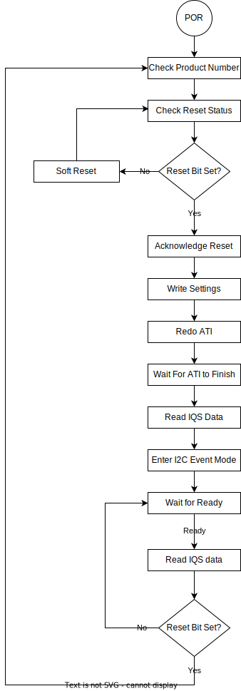
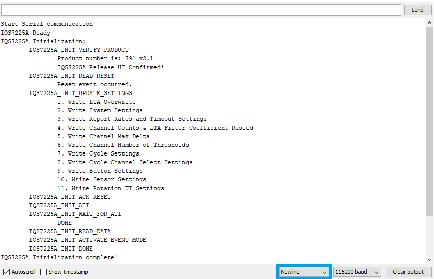

# IQS7225A Arduino Example Code

## Introduction
This Arduino example code demonstrates how to set up and use the IQS7225A Integrated Circuit (IC). The IQS7225A is a 6-channel device with self-capacitance, mutual-capacitance and inductive sensing modes, relative encoder UI, I2C communication interface and low-power mode options.

This example code is specifically aimed at the IQS7225A Evaluation Kit (PCB number _AZP1277A1_).

This example code is intended for an Arduino Compatible board that uses 3.3 V logic, such as [Sparkfun's Pro Micro (3.3V, 8 MHz)](https://learn.sparkfun.com/tutorials/pro-micro--fio-v3-hookup-guide/hardware-overview-pro-micro). If a 5V logic Arduino board is used, a logic-level translator will be required between the Arduino-based board and the IQS7225A.

## Arduino Code Configuration

The behaviour and pin assignments of the Arduino code can be configured with the `#define` settings at the start of `iqs7225a-example-code.ino`.

Change the following pin assignments and parameters to suit your hardware:

```c
/*** Defines ***/
#define DEMO_IQS7225A_ADDR                      0x44
#define DEMO_IQS7225A_POWER_PIN                 4
#define DEMO_IQS7225A_RDY_PIN                   7
```

* `DEMO_IQS7225A_ADDR` is the IQS7225A I2C Slave address. For more information, refer to the datasheet and application notes found on the [IQS7225A Product Page](https://www.azoteq.com/product/iqs7225a/).

* `DEMO_IQS7225A_POWER_PIN` can be used to power the IQS7225A directly from an Arduino GPIO. This parameter sets which pin to use. This is an optional setting and can be removed if the IQS7225A is powered from the VCC pin or an external power supply.

* `DEMO_IQS7225A_RDY_PIN` sets the pin assignment for the IQS7225A ready pin. This must support external interrupts. On the SparkFun Pro Micro, pins 0, 1, 2, 3, and 7 support interrupts.

> :memo: **Note:** Please note that powering an IQS device directly from a GPIO is _generally_ not recommended. However, the `DEMO_IQS7225A_POWER_PIN` in this example could be used as an enable input to a voltage regulator.

## Example Code Flow Diagram

<p align="center">
  
</p>

## Sparkfun Board Library Installation

To use the Sparkfun Pro Micro, the Sparkfun Board Library must be installed in the Arduino IDE.

Add the Sparkfun Board Library by opening Preferences (*File* > *Preferences*), and paste the following URL into the "Additional Board Manager URLs" text box.

```
https://raw.githubusercontent.com/sparkfun/Arduino_Boards/master/IDE_Board_Manager/package_sparkfun_index.json
```


Click "OK".
Then open the Board Manager under **Tools > Board > Boards Manager...**.


Search for "SparkFun", and install "SparkFun AVR Boards by SparkFun".


You can now select the "SparkFun Pro Micro" in the Board selection menu.


Also be sure to select the "3.3 V, 8 MHz" version under **Tools > Processor**.


Source:
[Pro Micro Hookup Guide]https://learn.sparkfun.com/tutorials/pro-micro--fio-v3-hookup-guide

## Serial Communication and Interface
The example code provides verbose serial feedback to aid in the demonstration of start-up and operational functions. It also has two built-in commands to demonstrate the IQS7225A device's functionality. To use this built-in commands, the Arduino code simply sends an 'f' or 'r' over the serial interface.

`1 - "f\n" - Force open a communication(RDY) window`

`2 - "r\n" - Request a Software Reset during runtime`

It is important to take note of the newline ('\n') character that is needed to complete any serial request. It can be activated in the built-in Arduino IDE Serial monitor and is shown inside the blue rectangle in the figure below.

